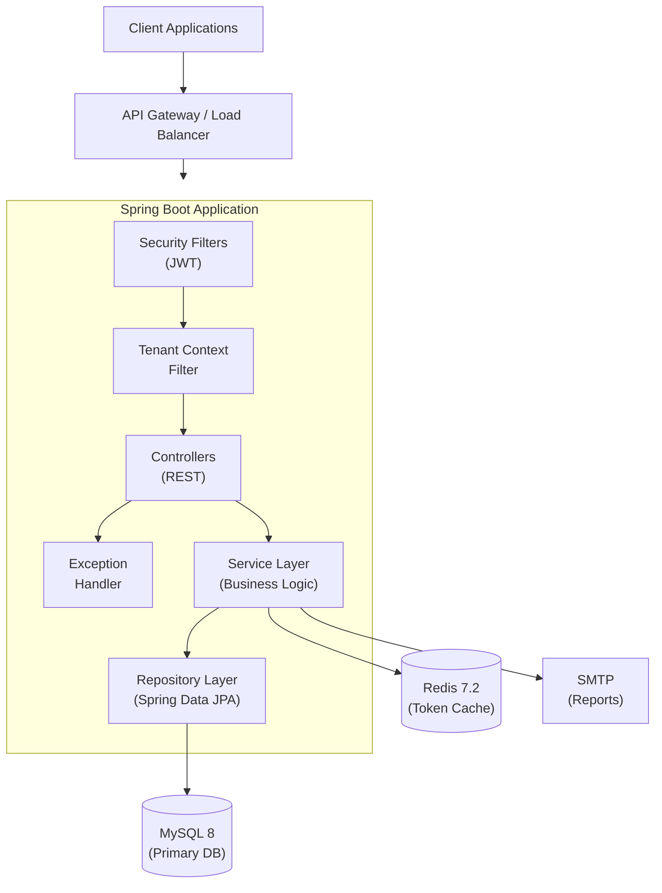

# Voucher Management System

[](https://openjdk.org/)
[](https://spring.io/projects/spring-boot)
[](https://www.mysql.com/)
[](https://redis.io/)
[]()

> A production-grade, multi-tenant voucher lifecycle platform built with Spring Boot. Supports voucher template management, purchases, redemptions, billing, transactions, tenant onboarding, PDF reporting, and full observability — all secured with JWT + RBAC.

---

## Table of Contents

- [Architecture](#architecture)
- [Features](#features)
- [Tech Stack](#tech-stack)
- [Fork & Setup Guide](#fork--setup-guide)
- [Configuration Reference](#configuration-reference)
- [API Reference](#api-reference)
- [Multi-Tenancy](#multi-tenancy)
- [Observability](#observability)
- [Testing](#testing)
- [Deployment](#deployment)
- [Contributing](#contributing)

---

## Architecture



**Key architectural decisions:**

- **Layered architecture** — Controller → Service → Repository with clean separation of concerns
- **Shared-schema multi-tenancy** — Single database with `tenant_id` column isolation at every layer
- **Stateless auth** — JWT access + refresh tokens; refresh tokens cached in Redis
- **Pessimistic locking** — Prevents concurrent overspending during voucher redemption
- **Idempotency** — `X-Request-ID` header support on all critical write operations

---

## Features

| Feature                  | Description                                                            |
| :----------------------- | :--------------------------------------------------------------------- |
| **Multi-Tenancy**        | Shared-schema with `SYSTEM_INDIVIDUAL` and `ORGANIZATION` tenant types |
| **Auth & RBAC**          | JWT access/refresh tokens with `PLATFORM_ADMIN`, `TENANT_ADMIN`, `USER` roles |
| **Voucher Lifecycle**    | Template creation → Purchase → Redemption → Transaction settlement     |
| **Tenant Onboarding**    | Self-service onboarding requests with platform admin approval workflow |
| **Inventory Management** | Tenant admin bulk purchase and distribution of voucher stock           |
| **Data Integrity**       | Pessimistic locking, BigDecimal monetary precision, idempotent writes  |
| **PDF Reporting**        | Async report generation with email delivery                           |
| **Observability**        | Prometheus metrics, Grafana dashboards, Loki log aggregation           |
| **API Documentation**    | Interactive Swagger UI with operation grouping                         |

---

## Tech Stack

| Layer              | Technology                                      |
| :----------------- | :---------------------------------------------- |
| **Runtime**        | Java 21, Spring Boot 3.4.2                      |
| **Security**       | Spring Security, JWT (jjwt 0.12.6)              |
| **Database**       | MySQL 8.4, Spring Data JPA, Hibernate           |
| **Cache**          | Redis 7.2 (refresh token storage)               |
| **Migrations**     | Flyway                                          |
| **Validation**     | Jakarta Bean Validation                         |
| **Docs**           | Springdoc OpenAPI 2.8.5                         |
| **Reporting**      | OpenHTMLtoPDF, Spring Mail                      |
| **Monitoring**     | Micrometer, Prometheus, Grafana, Loki, Promtail |
| **Build**          | Maven Wrapper                                   |
| **Containerization** | Docker (multi-stage build)                    |

---

## Fork & Setup Guide

Step-by-step instructions to get this project running on your machine after forking.

### Prerequisites

| Tool             | Version        | Install Guide                              |
| :--------------- | :------------- | :----------------------------------------- |
| **Java JDK**     | 21 or later    | https://adoptium.net/                      |
| **Docker**       | 20.10+         | https://docs.docker.com/get-docker/        |
| **Docker Compose** | 2.0+ (plugin) | Bundled with Docker Desktop              |
| **Git**          | Any recent     | https://git-scm.com/downloads             |

> **Note:** If you prefer running without Docker, you also need MySQL 8.x and Redis 7.x installed locally.

---

### Path A: Docker Compose (Recommended — Zero Local Dependencies)

This is the fastest way. Docker handles MySQL, Redis, and the full monitoring stack for you.

**Step 1: Fork and clone the repository**

```bash
# Fork the repo on GitHub, then clone your fork
git clone https://github.com/<YOUR_USERNAME>/VoucherManagementSystem.git
cd VoucherManagementSystem
```

**Step 2: Create the environment file**

```bash
cp .env.example .env
```

Open `.env` in your editor and fill in the values:

```properties
# --- Database ---
DB_URL=jdbc:mysql://mysql:3306/new_voucher_db?createDatabaseIfNotExist=true&useSSL=false&allowPublicKeyRetrieval=true&serverTimezone=UTC
DB_USERNAME=root
DB_PASSWORD=YourStrongPassword123!
MYSQL_ROOT_PASSWORD=YourStrongPassword123!

# --- JWT (generate a secure 64-char hex key) ---
JWT_SECRET=<paste output of: openssl rand -hex 32>

# --- Redis ---
REDIS_HOST=redis
REDIS_PORT=6379

# --- SMTP (optional — needed only for PDF report email delivery) ---
SMTP_HOST=smtp.gmail.com
SMTP_PORT=587
SMTP_USERNAME=your-email@gmail.com
SMTP_PASSWORD=your_16_char_app_password
SMTP_AUTH=true
SMTP_STARTTLS=true
REPORT_EMAIL_FROM=your-email@gmail.com
```

> **How to generate JWT_SECRET:**
>
> ```bash
> openssl rand -hex 32
> ```
>
> Copy the output and paste it as `JWT_SECRET` in your `.env` file.

<details>
<summary><strong>📧 Gmail App Password Setup (click to expand)</strong></summary>

1. Go to https://myaccount.google.com/security
2. Enable **2-Step Verification** if not already enabled
3. Go to https://myaccount.google.com/apppasswords
4. Select **"Mail"** → **"Other (Custom name)"** → name it `VoucherSystem`
5. Copy the 16-character password and paste as `SMTP_PASSWORD`
6. If you don't need email reports, you can skip SMTP configuration entirely — reports will generate PDFs but email delivery will fail gracefully

</details>

**Step 3: Build and start all services**

```bash
docker compose up -d --build
```

This command will:
- Build the Spring Boot application Docker image (multi-stage build)
- Start MySQL 8.4 and wait for it to be healthy
- Start Redis 7.2
- Start the application (auto-runs Flyway migrations on first boot)
- Start Prometheus, Grafana, Loki, and Promtail for monitoring

**Step 4: Verify everything is running**

```bash
# Check all containers are healthy
docker compose ps

# Check application health
curl http://localhost:8081/actuator/health
```

Expected response:

```json
{"status":"UP","components":{"db":{"status":"UP"},"redis":{"status":"UP"}}}
```

**Step 5: Access the application**

| Service          | URL                                              |
| :--------------- | :----------------------------------------------- |
| **API Base**     | http://localhost:8081/api/v1                      |
| **Swagger UI**   | http://localhost:8081/swagger-ui/index.html       |
| **OpenAPI Spec** | http://localhost:8081/v3/api-docs                 |
| **Prometheus**   | http://localhost:9090                             |
| **Grafana**      | http://localhost:3000 (default: admin / admin)    |

**Step 6: Create your first user and get a token**

```bash
# 1. Register a user
curl -X POST http://localhost:8081/api/v1/auth/register \
  -H "Content-Type: application/json" \
  -d '{
    "firstName": "John",
    "lastName": "Doe",
    "email": "john@example.com",
    "phoneNumber": "9876543210",
    "password": "Password@123"
  }'

# 2. Login to get JWT tokens
curl -X POST http://localhost:8081/api/v1/auth/login \
  -H "Content-Type: application/json" \
  -d '{
    "email": "john@example.com",
    "password": "Password@123"
  }'
```

The login response contains `accessToken` and `refreshToken`. Use the access token for all authenticated API calls:

```bash
curl -H "Authorization: Bearer <YOUR_ACCESS_TOKEN>" \
  http://localhost:8081/api/v1/vouchers
```

**Step 7: Promote a user to PLATFORM_ADMIN (required to create vouchers)**

```bash
# Connect to MySQL inside Docker
docker compose exec mysql mysql -u root -p new_voucher_db

# Run this SQL:
INSERT INTO user_roles (user_id, role_id)
SELECT u.id, r.id
FROM users u
JOIN roles r ON r.name = 'PLATFORM_ADMIN'
WHERE u.email = 'john@example.com';

# Exit MySQL
exit;
```

Now re-login to get a new token with the `PLATFORM_ADMIN` role.

**Step 8: Stop / restart services**

```bash
# Stop all services (data persists in Docker volumes)
docker compose down

# Stop and DELETE all data (fresh start)
docker compose down -v

# Restart everything
docker compose up -d
```

---

### Path B: Local Development (Without Docker)

Use this if you prefer to run the app directly on your machine with `./mvnw`.

**Step 1: Fork and clone**

```bash
git clone https://github.com/<YOUR_USERNAME>/VoucherManagementSystem.git
cd VoucherManagementSystem
```

**Step 2: Install and start MySQL**

```bash
# macOS (Homebrew)
brew install mysql && brew services start mysql

# Ubuntu / Debian
sudo apt-get install mysql-server && sudo systemctl start mysql

# Windows — download from https://dev.mysql.com/downloads/installer/
```

Create the database:

```sql
mysql -u root -p
CREATE DATABASE new_voucher_db;
exit;
```

**Step 3: Install and start Redis**

```bash
# macOS
brew install redis && brew services start redis

# Ubuntu / Debian
sudo apt-get install redis-server && sudo systemctl start redis

# Windows — use WSL2 or download from https://github.com/microsoftarchive/redis/releases
```

Verify Redis is running:

```bash
redis-cli ping
# Should print: PONG
```

**Step 4: Configure secrets**

```bash
mkdir -p config
cat > config/application-secrets.properties << 'EOF'
DB_PASSWORD=your_mysql_root_password
JWT_SECRET=paste_output_of_openssl_rand_hex_32_here
EOF
```

> **Important:** The `config/` directory is gitignored. Never commit secrets.

**Step 5: Run the application**

```bash
./mvnw spring-boot:run
```

On first run, Flyway will automatically create all database tables via migrations.

**Step 6: Verify**

```bash
curl http://localhost:8080/actuator/health
```

Open **Swagger UI** at: http://localhost:8080/swagger-ui/index.html

**Step 7:** Follow Steps 6-7 from Path A above (register user, promote to admin) — but use port `8080` instead of `8081`.

---

### Troubleshooting

| Problem                                   | Solution                                                    |
| :---------------------------------------- | :---------------------------------------------------------- |
| `Access denied for user 'root'`           | Check `DB_PASSWORD` in `.env` matches `MYSQL_ROOT_PASSWORD` |
| App container keeps restarting            | Run `docker compose logs app` — check for config errors     |
| `Connection refused` to MySQL             | MySQL may still be starting — wait 30s and retry            |
| Flyway checksum mismatch                  | Never edit existing migration files — create new ones       |
| SMTP email fails                          | SMTP config is optional; reports will show `FAILED` status  |
| `JWT signature does not match`            | Re-login — `JWT_SECRET` may have changed                    |
| Redis connection refused                  | Ensure Redis is running: `redis-cli ping`                   |
| Port `8081` / `3307` already in use       | Change ports in `docker-compose.yml` or stop conflicting app |

---

## Configuration Reference

All configuration is in `src/main/resources/application.properties` with environment variable overrides:

| Variable                        | Default                    | Required | Description                            |
| :------------------------------ | :------------------------- | :------- | :------------------------------------- |
| `DB_URL`                        | `jdbc:mysql://127.0.0.1:3306/new_voucher_db...` | No | JDBC connection URL         |
| `DB_USERNAME`                   | `root`                     | No       | Database username                      |
| `DB_PASSWORD`                   | —                          | **Yes**  | Database password                      |
| `JWT_SECRET`                    | —                          | **Yes**  | HMAC-SHA256 signing key (≥32 bytes)    |
| `JWT_ACCESS_EXPIRATION_SECONDS` | `6000`                     | No       | Access token TTL (seconds)             |
| `JWT_REFRESH_EXPIRATION_SECONDS`| `604800`                   | No       | Refresh token TTL (7 days)             |
| `REDIS_HOST`                    | `127.0.0.1`                | No       | Redis hostname                         |
| `REDIS_PORT`                    | `6379`                     | No       | Redis port                             |
| `REPORT_STORAGE_PATH`           | `./generated-reports`      | No       | PDF report output directory            |
| `REPORT_EMAIL_FROM`             | `no-reply@voucher.local`   | No       | Report sender email address            |
| `SMTP_HOST`                     | —                          | No*      | SMTP server host                       |
| `SMTP_PORT`                     | —                          | No*      | SMTP server port                       |
| `SMTP_USERNAME`                 | —                          | No*      | SMTP username                          |
| `SMTP_PASSWORD`                 | —                          | No*      | SMTP password / app password           |

> \* SMTP variables are required only if you need PDF report email delivery.

**Secrets management:** Use `config/application-secrets.properties` for local development. In production, use environment variables or a secrets manager (Vault, AWS Secrets Manager, K8s secrets).

---

## API Reference

All endpoints are prefixed with `/api/v1`. Full interactive documentation is available at the [Swagger UI](http://localhost:8081/swagger-ui/index.html).

### Authentication

| Method | Endpoint           | Access   | Description                         |
| :----- | :----------------- | :------- | :---------------------------------- |
| `POST` | `/auth/register`   | Public   | Create a new user account           |
| `POST` | `/auth/login`      | Public   | Authenticate and receive JWT tokens |
| `POST` | `/auth/refresh`    | Public   | Refresh access token                |
| `POST` | `/auth/logout`     | Public   | Revoke refresh token                |

### Voucher Templates (Platform Admin)

| Method  | Endpoint                        | Access           | Description                |
| :------ | :------------------------------ | :--------------- | :------------------------- |
| `POST`  | `/admin/vouchers`               | `PLATFORM_ADMIN` | Create a voucher template  |
| `PATCH` | `/admin/vouchers/{id}/status`   | `PLATFORM_ADMIN` | Enable/disable a template  |

### User Vouchers

| Method | Endpoint                 | Access                      | Description                       |
| :----- | :----------------------- | :-------------------------- | :-------------------------------- |
| `GET`  | `/vouchers`              | `USER`, `TENANT_ADMIN`      | List eligible voucher templates   |
| `POST` | `/vouchers/purchase`     | `USER`                      | Purchase a voucher                |
| `POST` | `/vouchers/redeem`       | `USER`                      | Redeem voucher against a bill     |
| `GET`  | `/vouchers/mine`         | `USER`                      | List own vouchers                 |
| `GET`  | `/vouchers/redemptions`  | `USER`                      | View redemption history           |
| `GET`  | `/vouchers/admin/issued` | Admin                       | Filter issued vouchers            |

### Bills & Transactions

| Method | Endpoint                        | Access          | Description                  |
| :----- | :------------------------------ | :-------------- | :--------------------------- |
| `POST` | `/bills`                        | Admin           | Create a bill                |
| `GET`  | `/bills/{id}`                   | Admin / Owner   | Get bill by ID               |
| `GET`  | `/bills/user/{userId}`          | Admin / Owner   | List user's bills            |
| `GET`  | `/transactions/user/{userId}`   | Admin / Owner   | List user's transactions     |
| `GET`  | `/transactions`                 | Admin           | Filter all transactions      |

### Tenant Administration

| Method | Endpoint                       | Access         | Description                  |
| :----- | :----------------------------- | :------------- | :--------------------------- |
| `POST` | `/tenant/vouchers/purchase`    | `TENANT_ADMIN` | Purchase voucher stock       |
| `POST` | `/tenant/vouchers/distribute`  | `TENANT_ADMIN` | Distribute stock to users    |
| `GET`  | `/tenant/vouchers/inventory`   | `TENANT_ADMIN` | View inventory               |
| `POST` | `/tenant/vouchers/requests`    | `TENANT_ADMIN` | Request custom voucher       |

### Platform Management

| Method  | Endpoint                                       | Access           | Description                 |
| :------ | :--------------------------------------------- | :--------------- | :-------------------------- |
| `POST`  | `/tenant-onboarding/requests`                  | Public           | Submit onboarding request   |
| `GET`   | `/platform/onboarding/requests`                | `PLATFORM_ADMIN` | List onboarding requests    |
| `PATCH` | `/platform/onboarding/requests/{id}/decision`  | `PLATFORM_ADMIN` | Approve/reject request      |
| `GET`   | `/platform/tenants`                            | `PLATFORM_ADMIN` | List all tenants            |
| `PATCH` | `/platform/tenants/{id}/status`                | `PLATFORM_ADMIN` | Activate/deactivate tenant  |
| `POST`  | `/platform/tenants/{id}/tenant-admins`         | `PLATFORM_ADMIN` | Create tenant admin         |
| `GET`   | `/platform/tenants/{id}/audit-logs`            | `PLATFORM_ADMIN` | View audit history          |

### Reports

| Method | Endpoint                | Access           | Description                        |
| :----- | :---------------------- | :--------------- | :--------------------------------- |
| `POST` | `/reports/me/email`     | `USER`           | Request personal report via email  |
| `POST` | `/reports/tenant/email` | `TENANT_ADMIN`   | Request tenant report              |
| `GET`  | `/reports/{id}`         | `PLATFORM_ADMIN` | Check report job status            |

### Error Response Format

All errors follow a consistent structure:

```json
{
  "status": 400,
  "error": "Bad Request",
  "message": "Descriptive error message",
  "timestamp": "2026-03-26T10:30:00Z"
}
```

---

## Multi-Tenancy

The system uses a **shared-schema** multi-tenancy model with `tenant_id` isolation enforced at every layer:

```
Request → TenantContextFilter → JWT Claim → Service Layer → Repository → Database
```

**Tenant resolution rules:**

| Scenario                               | Resolution                                   |
| :------------------------------------- | :------------------------------------------- |
| Authenticated request                  | Tenant ID from JWT claim (source of truth)   |
| Authenticated + `X-Tenant-Code` header | Must match JWT tenant, or `403 Forbidden`    |
| Unauthenticated + `X-Tenant-Code` header | Resolve from header                        |
| Unauthenticated, no header             | Defaults to `SYSTEM_INDIVIDUAL`              |

**Tenant types:**

- `SYSTEM_INDIVIDUAL` — Default platform tenant for direct users
- `ORGANIZATION` — Isolated tenant with its own admin, inventory, and user base

**Working with organization tenants:**

```bash
# Register under a specific tenant
curl -X POST http://localhost:8081/api/v1/auth/register \
  -H "Content-Type: application/json" \
  -H "X-Tenant-Code: ACME" \
  -d '{
    "firstName": "Jane",
    "lastName": "Admin",
    "email": "jane@acme.com",
    "phoneNumber": "9876543211",
    "password": "Password@123"
  }'
```

---

## Observability

The full **PLG stack** (Prometheus + Loki + Grafana) is included in `docker-compose.yml`:

| Component      | Purpose                                       | Port   |
| :------------- | :-------------------------------------------- | :----- |
| **Prometheus** | Metrics collection from `/actuator/prometheus` | `9090` |
| **Loki**       | Centralized log aggregation                   | `3100` |
| **Promtail**   | Log shipper (reads structured JSON logs)      | —      |
| **Grafana**    | Dashboards and alerting                       | `3000` |

**Structured logging** uses Logstash JSON encoder with MDC fields:

- `tenantId` — Tenant context for multi-tenant log filtering
- `method`, `path`, `status` — HTTP request metadata

---

## Testing

The project includes comprehensive unit and integration tests:

```bash
# Run all unit tests
./mvnw test

# Run a specific test class
./mvnw test -Dtest="UserVoucherServiceImplTest"

# Run integration tests (requires MySQL + Redis)
./mvnw verify -Dtest="com.example.Voucher.integration.*"
```

**Test coverage:**

| Layer                          | Test Files              | Coverage Areas                                |
| :----------------------------- | :---------------------- | :-------------------------------------------- |
| **Unit Tests** (8 classes)     | `*ServiceImplTest.java` | All service implementations with Mockito      |
| **Integration Tests** (10 files) | `*IntegrationTest.java` | Auth, tenants, idempotency, billing, reports |

---

## Deployment

### Docker Build

The Dockerfile uses a **multi-stage build** with a non-root runtime user:

```bash
# Build and run
docker build -t voucher-system .
docker run -p 8080:8080 --env-file .env voucher-system
```

### Production Checklist

- [ ] Set strong `JWT_SECRET` (64+ character hex string)
- [ ] Set unique `DB_PASSWORD`
- [ ] Configure Redis authentication
- [ ] Disable SQL logging (`spring.jpa.show-sql=false`)
- [ ] Configure SMTP credentials for report emails
- [ ] Set up health check probes (liveness + readiness)
- [ ] Enable rate limiting at the API gateway layer
- [ ] Configure CORS allowed origins
- [ ] Remove `.env` from version control

### Database Migrations

Flyway manages schema migrations automatically on startup. Hibernate is set to `validate` — it never modifies the schema.

| Migration                                  | Description                              |
| :----------------------------------------- | :--------------------------------------- |
| `V1__baseline_schema.sql`                  | Core domain tables                       |
| `V2__multitenancy_bootstrap.sql`           | Tenant infrastructure + backfill         |
| `V3__tenant_audit_logs.sql`                | Audit trail                              |
| `V4__tenant_voucher_inventory.sql`         | Inventory + distribution tables          |
| `V5__tenant_custom_voucher_requests.sql`   | Custom voucher request table             |
| `V6__report_jobs.sql`                      | Async report tracking                    |
| `V7__tenant_onboarding_requests.sql`       | Self-service onboarding                  |
| `V8__idempotency_request_ids.sql`          | Request ID columns + unique constraints  |

---

## Project Structure

```
src/main/java/com/example/Voucher/
├── config/          # CORS, async, OpenAPI, monitoring, MDC filter
├── controller/      # REST endpoints (11 controllers)
├── dto/             # Request/response DTOs with validation
├── entity/          # JPA entities with tenant-aware constructors
├── exception/       # Global exception handler + custom exceptions
├── platform/        # Platform-level tenant management
├── report/          # PDF rendering + async email delivery
├── repository/      # Spring Data JPA repositories
├── security/        # JWT filter, service, config, role seeding
├── service/         # Service interfaces
├── serviceImpl/     # Business logic (8 implementations)
└── tenant/          # Tenant context, filter, resolver
```

---

## Contributing

1. Fork the repository and create a feature branch from `main`
2. Follow existing code conventions (layered architecture, tenant-scoped queries)
3. Add unit tests for all new service methods
4. Ensure all tests pass: `./mvnw test`
5. Keep secrets out of version control — use `config/application-secrets.properties`
6. Flyway migrations are append-only — never modify existing migration files
7. Submit a pull request with a clear description of changes

---

## License

Proprietary — All rights reserved.
